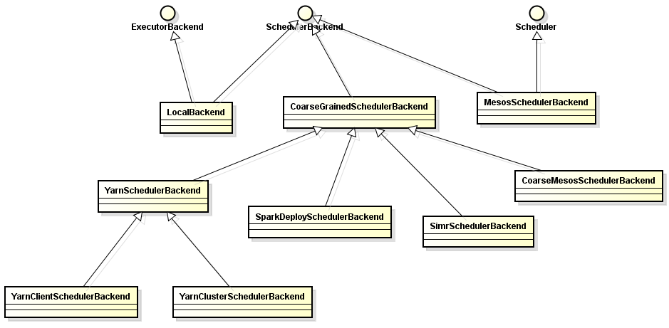

### Spark任务提交

不论是调用saveAsHadoopDataset方法还是调用其他的方法启动Spark任务，触发action操作后，最终都会调用SparkContext中的runJob方法，该方法在RDD的所有分区上运行任务，
并且以数据的方式返回结果，它是Spark里所有action的主入口。它内部是调用dagScheduler的runJob方法执行，runJob方法中通过submitJob方法进行任务的
提交，并返回JobWaiter对象，该对象会等待job的执行完成，然后传递所有的结果到resultHandler方法进行后续的处理。

调用关系如下：

org.apache.spark.SparkContext#runJob
org.apache.spark.scheduler.DAGScheduler#runJob
org.apache.spark.scheduler.DAGScheduler#submitJob
org.apache.spark.scheduler.DAGSchedulerEventProcessLoop#onReceive（JobSubmitted）
org.apache.spark.scheduler.DAGSchedulerEventProcessLoop#doOnReceive（JobSubmitted）
org.apache.spark.scheduler.DAGScheduler#handleJobSubmitted

在submitJob方法中进行提交前，会先进行必要的检查以确保没有在一个不存在的分区上提交任务。在创建jobId后创建JobWaiter对象，并使用类型为DAGSchedulerEventProcessLoop
的对象eventProcessLoop，将任务提交JobSubmitted对象放置在event队列中，eventThread后台线程将对任务提交进行处理，这个eventThread被定义在DAGSchedulerEventProcessLoop
的父类EventLoop当中。EventLoop就是从调用者接收事件并且启动给一个额外的eventThread对所有在eventThread中的事件进行处理。(值得注意的是在EventLoop中，事件队列
eventQueue是一个LinkedBlockingDeque可能会无限制的增长，因此子类在继承EventLoop时必须实现onReceive方法并确保onReceive能够及时的处理事件以避免可能的OOM错误.)

DAGSchedulerEventProcessLoop就是EventLoop的子类，它对onReceive进行了实现，主要是在其中调用了doOnReceive方法，在doOnReceive方法的具体实现中，
会根据事件类型调用对应的方法进行处理，此处是JobSubmitted类型事件，所以会调用dagScheduler的handlerJobSubmitted方法完成整个job的提交。

在handlerJobSubmitted方法中首先会根据RDD创建finalStage，finalStage就是最后的那个Stage。Stage又是什么呢？在[Spark源码阅读2：创建SparkContext](./sparkcontext.md)
已经说过，Task是集群上运行的基本单位，一个Task会负责处理RDD的一个Partition。所以RDD的多个partition会分别由不同的Task去处理，虽然这些Task的
处理逻辑完全是一样的。这一组Task就组成了一个Stage，一个Stage的开始就是从外部存储或者shuffle结果中读取数据，一个Stage的结束就是由于发生shuffle
或者生成结果时，而一个Job则包含多个Stage。

然后创建job，最后进行提交job。提交的job如果满足
以下四个条件，将以本地模式运行：
(1) spark.localExecution.enable设置为true
(2) 用户程序显式指定可以本地运行
(3) finalStage没有父stage
(4) 仅有一个partition

资源调度SchedulerBackend类及相关子类如下图：

