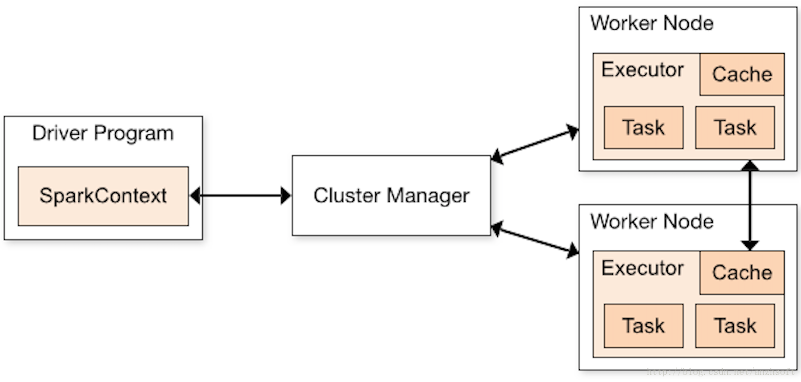
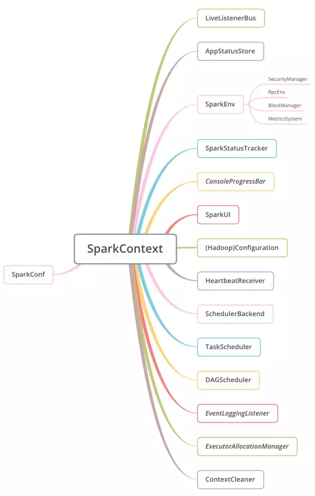

### SparkContext构建

对Spark有所了解的同学都知道，SparkContext绝对是Spark编程非常重要且经常接触的一个东西，可以说是核心中的核心。它存在于Driver中，是开发Spark应用的入口，
负责和整个集群的交互，包括申请集群资源、创建RDD、创建累加器和广播变量等。理解Spark的架构就必须从这个入口开始。下图是官网的一张Spark架构图：

对于该图官网有几点说明：

  (1) 不同的Spark应用程序对应着不同的Executor，这些Executor在整个应用程序执行期间都存在，并且可以以多线程的方式执行Task，Task是集群上
运行的基本单位。(Hmmmm....回忆一下，Storm中也有Executor，但Storm中的Executor是一个单独的线程，默认里面有一个Task，如果设置多个，同一个
Executor中的Task必须是同类型的，要么是Spout，要么是bolt，并且多个Task以串行方式执行，因此Storm中运行的基本单位其实是Executor。Flink中
呢，没有Executor，与之对应的个人觉得应该是Slot，Slot中以多线程的方式运行Task，每个Task是一个线程，因此Flink中运行的基本单位也是Task。)
Spark这样做的好处是，各个Spark应用程序的执行是相互隔离的，除了Spark应用程序向外部存储系统写数据进行数据交互外，无法进行其他形式的数据共享。

  (2) Spark对于其使用的集群资源管理器没有感知能力，只要它能申请Executor并与之通信即可。这样设计的好处是，无论使用哪种资源管理器，执行流程都是
确定的，它不受资源管理器的限制，可以随意替换其资源管理器，于是可以很方便的替换为YARN或Mesos之类的资源管理器。

  (3) Spark应用程序在整个执行过程中都要与Executors进行来回通信。

  (5) Driver端负责Spark应用程序任务的调度，所以Driver应尽量靠近Worker节点。

  另外，图中DriverProgram就是用户提交的程序，里面就定义有SparkContext的的实例。SparkContext默认的构造函数接受的是org.apache.spark.SparkConf，
通过这个参数我们可以自定义提交的参数，这个参数会覆盖系统提供的默认配置。

SparkContext初始化了很多的组件，并且使用其预先定义的私有变量字段维护了其需要初始化的组件的内部状态。下图是SparkContext负责初始化的组件一览：

下面对这些组件做一些简要的介绍：
  * SparkConf，这个在[Spark源码阅读1：SparkConf](../master/docs/sparkconf.md)中已经介绍过，它是构造SparkContext时传进来的参数。SparkContext
  会先将传进来的SparkConf克隆一份(此时就理解了为何SparkConf需要继承了Cloneable这个trait)，然后在克隆出的副本上进行校验(主要是应用名和Master的校验)，
  并且添加一些其它的必要的参数(Driver的地址、应用ID等)。克隆出来的SparkConf使得用户不可以再更改配置项，保证了Spark配置在运行时的不可变性。

  * LiveListenerBus，是SparkContext中的事件总线，它异步的将监听器事件(SparkListenerEvents)传递给已经注册的监听器(SparkListeners)，这是一种
  监听器设计模式，Spark中大量的应用了这种设计模式以适应集群环境下的分布式事件汇报。除了LiveListenerBus外，Spark中还有其它多种事件总线，它们都继承自
  ListenerBus特征(trait)，事件总线是Spark底层重要的支撑组件。

  * AppStatusStore，看名字就知道是一个存储支撑组件，它提供Spark程序运行过程中各项指标的键值对存储，UI上看到的数据指标基本上都存储在这里，底层使用的是
  ElementTrackingStore，这是一种能够跟踪特定类型的元素的数量并且一旦达到阈值就触发事件的的键值对存储结构，比较适用于监控场景。此外，还会产生一个监听器
  AppStatusListener实例，并注册到上面的LiveListenerBus中去用来收集监控数据。

  * SparkEnv，是Spark的执行环境，Driver和Executor都需要SparkEnv提供的各类组件形成的执行环境作为基础，其初始化依赖于LiveListenerBus，且在
  SparkContext的初始化时只创建了Driver的执行环境，Executor的执行环境将会在后面创建。在创建完成Driver的执行环境后，会使用SparkEnv伴生对象中的set()
  方法保存它，做到"create once，use anywhere"。通过SparkEnv管理的组件很多，包括安全管理器SecurityManager、RPC环境RpcEnv、存储块管理器
  BlockManager、监控指标系统MetricsSystem。在SparkContext构造方法中，使用了SparkEnv初始化BlockManager和启动MetricsSystem。

  * SparkStatusTracker，它提供了报告监控任务和stage进度的低级API，从传入的AppStatusStore中获取包括特定job group下的任务列表、活跃的Job ID/Stage ID、
  Job信息/Stage信息、Executor信息(包括所在主机、运行端口、缓存大小、运行任务数、内存使用量等基础数据)，这个API只能保证非常弱的一致性语义，它报告的信息会有
  延迟或缺漏(这个应该还是能够理解，根据分布式系统的CAP理论，这个API既然是分布式环境下的，那么在保证其高可用性的情况下就必须对一致性有所取舍，毕竟不是数据库，
  优先选择可用性而舍弃强一致性的保证也是可以接受的，而且既然是接口就也很难做到像大多数分布式系统的设计那样保证最终一致性^-^)。

  * ConsoleProgressBar，它按行打印Stage的计算进度，周期性的从AppStatusStore中查询活跃Stage对应的各状态的Task数，并格式化为字符串输出，它可以通过
  spark.ui.showConsoleProgress配置来控制是否开启，默认不开启。

  * SparkUI，维护监控数据在Web UI界面的展示，可以通过spark.ui.enabled控制是否启用，默认为true，然后用SparkUI的父类WebUI的bind()方法，将UI绑定到
  特定的主机和端口上，默认端口是4040(tomcat的默认端口8080的一半，很好记)。

  * Configuration，这是Hadoop所需要的配置文件，Spark的运行可能需要Hadoop相关的一些组件，包括Hdfs和YARN等，SparkContext会借助工具类SparkHadoopUtil
  初始化Hadoop相关的配置，放在Hadoop的Configuration中，如Amazon S3相关的配置、"spark.hadoop."开头的配置、"spark.hive."开头的配置等。

  * HeartBeatReceiver，这是个心跳接收器，Executor需要定期向Driver发送心跳包来表明自己的存活状态，继承自SparkListener，它通过RpcEnv最终包装成了一个RPC
  终端的引用。Spark集群的节点间涉及到大量的网络通信，心跳只是其中的一个部分，因此RPC框架也是Spark底层的重要组成。

  * SchedulerBackend，负责资源的分配，它为等待运行的Task分配计算资源，并负责Task在Executor上的启动，在不同的部署模式下有不同的SchedulerBackend的实现。

  * TaskScheduler，是一个任务调度器，负责提供Task的调度算法，并持有SchedulerBackend的实例，通过SchedulerBackend发挥作用。它通过createTaskScheduler
  方法，可以获得不同资源管理类型或部署类型的调度器，现阶段支持：local本地单线程、local[k]本地k个线程、local[*]本地cpu核数个线程、spark支持
  的Spark Standalone、yarn支持连接YARN等。对于Standalone模式来说，scheduler的实现是TaskSchedulerImpl，它通过一个SchedulerBackend管理所有Cluster
  的调度，实现了通用的逻辑。系统刚启动时，有两个函数需要注意：initialize()和start()，它们也是在SparkContext初始化时调用的。initialize()方法主要是完成了
  SchedulerBackend的初始化，通过集群的配置来获取调度模式，目前支持两种调度模式：FIFO和公平调度，默认是FIFO调度模式。start()方法主要是backend的启动。对于
  非本地模式且设置了spark.speculation为true的情况，指定时间未返回的task会启动另外的task去执行。对于一般应用，这在可能减少任务的执行时间的同时，也造成了集群
  计算资源的浪费。因此对于时效性要求不高的离线应用来说，不推荐这样的设置。Standalone模式的SchedulerBackend是SparkDeploySchedulerBackend。

  * DAGScheduler，是一个有向五环图(DAG)的调度器，DAG用于表示RDD之间的血缘。DAGScheduler负责生成并提交Job，以及按照DAG将RDD和算子划分Stage并提交。每个
  Stage都包含一组Task称为TaskSet(TaskSet的划分方式后面会具体分析)，TaskSet被传递给TaskScheduler，也就是DAGScheduler比TaskScheduler优先。DAGScheduler
  是直接通过new产生，其构造方法里会将SparkContext中的TaskScheduler的引用传递进去。因此要等DAGScheduler创建后，才会正在启动TaskScheduler。

  * EventLoggingListener，用于事件持久化的监听，通过spark.eventLog.enabled配置参数控制是否开启，默认false不开启，如果选择开启，那么它也会被注册到
  LiveListenerBus里，并将特定事件写入到磁盘。

  * ExecutorAllocationManager，是executor分配管理器，通过spark.dynamicAllocation.enabled配置参数进行控制，默认也是false，表示不会根据负载调整
  executor的数量。如果开启，并且SchedulerBackend的实现类支持这种机制，Spark就会根据程序运行时的负载动态增减Executor的数量。

  * ContextCleaner，也就是上下文清理器，它可以通过spark.cleaner.referenceTracking配置参数进行控制是否启用，默认值为true，它的内部维护着对RDD、Shuffle
  依赖和广播变量的弱引用，如果弱引用超过其作用域会异步的被清理。

最后的最后，来一张Spark资源调度SchedulerBackend类及相关子类的类图吧：

