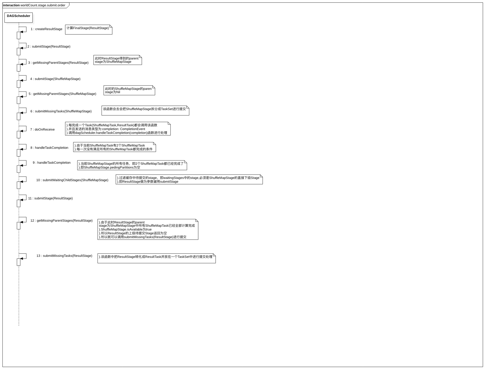

### Stage的提交

在[Spark源码阅读30：Spark任务提交](./jobsubmit.md)里已经介绍到了任务提交时会调用handleJobSubmitted进行任务的提交，接着继续往下追，其后
的调用流程是：

org.apache.spark.scheduler.DAGScheduler.handleJobSubmitted
org.apache.spark.scheduler.DAGScheduler.handleJobSubmitted.submitStage
org.apache.spark.scheduler.DAGScheduler.handleJobSubmitted.submitMissingTasks
org.apache.spark.scheduler.TaskScheduler.submitTasks

在handleJobSubmitted方法中，首先调用createResultStage()方法，生成Stage，包括最后一个Stage：ResultStage和前面的Parent Stage：ShuffleMapStage，随后
创建一个ActiveJob对象job，并清除RDD分区位置缓存，调用logInfo()方法记录日志信息，维护各种数据对应关系涉及到的数据结构：(1) 将jobId-->ActiveJob的对应关系
添加到HashMap类型的数据结构jobIdToActiveJob中去; (2) 将ActiveJob添加到HashSet类型的数据结构activeJobs中去。最后，提交Stage。

下面进行具体的分析：在调用createResultStage()方法时，先根据final RDD获取parent stages，如果在获取的过程中某个shuffle map stage不存在，则会先创建它并创建
它的对应的所有祖先Stage。然后创建一个ResultStage，其id是通过AtomicInteger类型的getAndIncrement()获得，能够保证原子性，这个ResultStage就是整个Job的final Stage，
将这个Stage加入到数据结构stageIdToStage中，并更新数据结构jobIdToStageIds，最后将这个ResultStage返回。

在创建好finalStage并做好相关的设置后，最后会调用submitStage将其进行提交，在通过submitStage提交finalStage时，方法会递归的将finalStage依赖的父stage先提交，最后
再提交finalStage，提交时调用submitMissingTasks方法。代码的具体逻辑比较简单，先根据stage获取到jobId，如果jobId没有定义，说明该Stage不属于运行中的Job，则调用
abortStage()方法放弃该stage。如果jobId已经定义，则需要判断该stage是否属于waitingStages、runningStages、failedStages中的任意一个，若是则忽略不处理。waitingStages
表示等待处理的stages，由于Spark采取由前往后的顺序处理stage的提交，即先处理parent stage，然后再处理child stage，所以在waitingStages中的stage由于其parent stage尚未
处理，所以必须先等待parent stage的处理。runningStages表示正在运行的stage，正在运行表示已经被提交，无需重复提交。failedStages表示失败的stage，已经失败的stage再次提交
仍然会失败，所以也无需提交。如果stage不存在于上述三个数据结构中，就可以继续执行后续的提交流程。

首先，调用getMissingParentStages()方法获取stage还没有提交的parent，即missing。若missing为空，说明该stage要么没有parent stage，要么其parent stages都已经被提交，
此时该stage就可以被提交，调用submitMissingTasks()进行提交；若missing不为空，说明该stage还存在尚未被提交的parent stages，就需要遍历missing，循环提交每个stage，并将
该stage添加到waitingStages中，等待其parent stages都被提交后再被提交。在getMissingParentStages()方法中，定义了三个数据结构和一个visit()方法。三个数据结构分别是：
(1) missing：HashSet[Stage]类型，存储尚未提交的parent stages，用于最后结果的返回；(2) visited：HashSet[RDD[_]]类型，已被处理的RDD集合，位于其中的RDD不会被重复处理；
(3) waitingForVisit：ListBuffer[RDD[_]]类型，等待被处理的RDD集合。visit()方法的处理逻辑也比较简单：通过RDD是否在visited中判断RDD是否已处理，若未被处理，添加到visited
中，然后循环rdd的dependencies，如果是宽依赖ShuffleDependency，getOrCreateShuffleMapStage()，获取ShuffleMapStage（此次调用则是直接取出已生成的stage，因为划分阶段已
将stage全部生成），判断该stage的isAvailable标志位，若为false，则说明该stage未被提交过，加入到missing集合，如果是窄依赖NarrowDependency，直接将RDD压入waitingForVisit
栈，等待后续处理，因为窄依赖的RDD同属于同一个stage，加入waitingForVisit只是为了后续继续沿着DAG图继续往上处理。那么，整个missing的获取就一目了然，将final stage即ResultStage
的RDD压入到waitingForVisit顶部，循环处理即可得到missing。

在submitMissingTasks方法中，在查找missing(也就是未提交的stages)的分区前，先进行中间状态的清除工作，这个操作能够保证，对于部分完成的中间状态，findMissingPartitions()
方法每次都能返回所有的分区。具体办法是判断stage是否是ShuffleMapStage，在DAG Stage中，除了最后的Stage外，其余的全部都是ShuffleMapStage。如果是ShuffleMapStage，并且
还没有被提交，则先执行中间Stage的清理工作。然后调用findMissingPartitions()方法确定该stage需要计算的分区ID索引，保存到partitionsToCompute。将stage加入到runningStages
中去，标记stage正在运行。当一个stage启动时，需要先调用outputCommitCoordinator的stageStart进行初始化。然后创建一个Map：taskIdToLocations，存储的是id->Seq[TaskLocation]
的映射关系，并对stage中指定RDD的每个分区获取位置信息，映射成id->Seq[TaskLocation]的关系，注意此处的getPreferredLocs()方法，很重要，它用于保证数据的本地性，是task获取最佳
执行位置的算法。标记新的stage attempt关系，并发送一个SparkListenerStageSubmitted事件。对stage进行序列化并广播，此时有两种情况，如果是ShuffleMapStage，则序列化rdd和
shuffleDep；如果是ResultStage，序列化rdd和func。接下来是一个比较重要的步骤，针对stage的每个分区构造task，形成tasks，因此stage的每个分区都会对应一个task，其中ShuffleMapStage
生成ShuffleMapTasks，ResultStage生成ResultTasks。如果tasks不为空，则利用taskScheduler.submitTasks()提交task，否则标记stage已完成。

